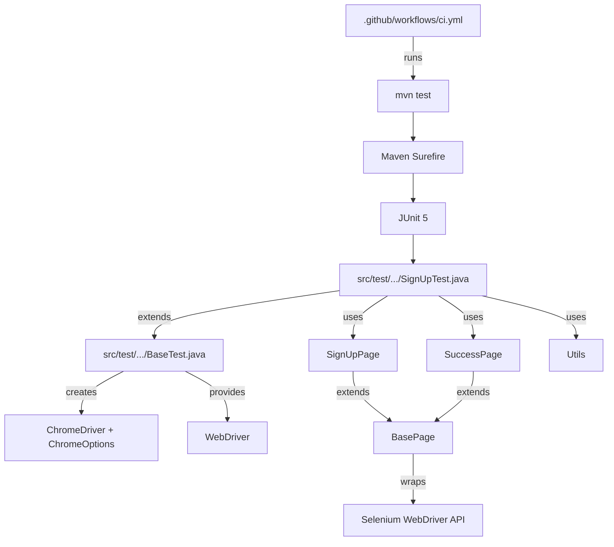

# Workflow and Implementation (End-to-End)

This document explains the **full workflow** of the Newsletter Selenium test suite—from a high-level view (CI → build → test execution) down to a **file-by-file implementation map** showing how the classes connect.

## Big picture

There are two main ways the suite runs:

- **Local run (developer machine)**: you run Maven; tests open Chrome in headed mode by default.
- **CI run (GitHub Actions)**: GitHub Actions runs Maven on Ubuntu; Chrome runs **headless**; reports/logs are uploaded as artifacts; Slack/email notifications can be sent.

At runtime, the call chain looks like this:

- `mvn test` (Maven Surefire)
  - JUnit 5 discovers tests under `src/test/java`
    - Each test class extends `BaseTest`
      - `BaseTest.setUp()` creates a new `ChromeDriver`
      - Tests call **Page Objects** (`SignUpPage`, `SuccessPage`)
        - Page Objects use shared Selenium helpers from `BasePage`
      - Test data is generated by `Utils`
      - `BaseTest.tearDown()` quits the driver

## Repository map (what lives where)

### CI / quality tooling

- `.github/workflows/ci.yml`: CI pipeline that runs `mvn test`, uploads artifacts, and sends notifications.
- `CI_WORKFLOW.md`: written explanation of the CI workflow.
- `qodana.yaml`: static analysis configuration (JetBrains Qodana).

### Build configuration

- `pom.xml`: Maven build config + dependencies + Surefire (test runner) configuration.

### Test code (JUnit 5)

- `src/test/java/com/newsletter/tests/BaseTest.java`: WebDriver lifecycle (setup/teardown) + logging + headless toggle for CI.
- `src/test/java/com/newsletter/tests/SignUpTest.java`: the functional UI tests for the newsletter sign-up flow.

### Application interaction layer (Page Object Model)

- `src/main/java/com/newsletter/pages/BasePage.java`: shared Selenium primitives (waits, click/type, visibility helpers).
- `src/main/java/com/newsletter/pages/SignUpPage.java`: page object for the sign-up form (locators + form actions + validation helpers).
- `src/main/java/com/newsletter/pages/SuccessPage.java`: page object for the success screen (assertions + dismiss).

### Utilities

- `src/main/java/com/newsletter/utils/Utils.java`: random valid/invalid email generation, plus small data-provider helpers for parameterized tests.

## How everything is connected (dependency graph)

Mermaid diagram (read top-to-bottom):

Key takeaways:

- **Tests never directly store locators**; locators live in Page Objects.
- **WebDriver creation is centralized** in `BaseTest`.
- **Waiting/click/type primitives are centralized** in `BasePage` (explicit waits).
- **Test data generation is centralized** in `Utils`.

## Execution flow (local vs CI)

### Local execution flow

1. You run tests with Maven:
   - Typical:
     - `mvn clean test`
2. Maven Surefire starts a JVM and runs JUnit 5 tests.
3. For each `@Test` / parameterized invocation:
   - `BaseTest.setUp()` runs (`@BeforeEach`)
     - Chrome starts **headed** by default
   - Test steps run (navigate, enter email, submit, assert)
   - `BaseTest.tearDown()` runs (`@AfterEach`)
     - Chrome closes

### CI execution flow (GitHub Actions)

The CI pipeline is defined in `.github/workflows/ci.yml` and does (at a high level):

1. **Checkout code**
2. **Set up Java** (matrix currently uses Java 17)
3. **Install dependencies** (`mvn clean install -DskipTests`)
4. **Run tests** (`mvn test -B -V`)
   - Environment variables force headless execution:
     - `CI=true`
     - `HEADLESS=true`
5. **Upload artifacts** (always, even on failure):
   - `target/surefire-reports/` (JUnit XML)
   - `target/logs/` (java.util.logging logs from `BaseTest`)
   - `target/**/*.png` / `screenshots/**/*.png` (if produced)
6. **Parse XML results** to compute totals + failing tests summary
7. **Notify** (optional, based on secrets):
   - Slack webhook message
   - Email via SMTP

## Implementation details (file-by-file)

### `pom.xml` (build + dependencies)

Responsibilities:

- Declares dependencies used by the test framework:
  - Selenium (`org.seleniumhq.selenium:selenium-java`)
  - WebDriverManager (`io.github.bonigarcia:webdrivermanager`)
  - JUnit 5 (`org.junit.jupiter:junit-jupiter`)
- Configures **Maven Surefire Plugin** to run JUnit 5 tests and generate XML reports under:
  - `target/surefire-reports/`
- Defines the project’s **compile level** (currently `source/target = 11`).

Connection points:

- Enables running `src/test/java/...` tests via `mvn test`.
- Produces the XML that the CI workflow parses.
- Note: CI may run with a newer JDK (currently Java 17), while still compiling to Java 11 bytecode as configured here.

### `.github/workflows/ci.yml` (CI orchestration)

Responsibilities:

- Provides a reproducible environment (`ubuntu-latest`, Java via `setup-java`)
- Runs Maven commands
- Uploads artifacts (reports/logs/screenshots)
- Aggregates test outcomes and posts notifications

Connection points:

- Forces headless behavior by setting:
  - `CI=true` and `HEADLESS=true`
  - `BaseTest` reads these to decide ChromeOptions.
- Consumes JUnit XML from Surefire (`target/surefire-reports/TEST-*.xml`) to compute pass/fail totals.
- Uploads `target/logs/` produced by `BaseTest.configureRootLogging()`.

### `src/test/.../BaseTest.java` (WebDriver lifecycle + logging)

Responsibilities:

- Owns the shared `WebDriver driver` field used by tests.
- Runs once-per-run logging configuration (static initializer):
  - Console logs for live output
  - File logs under `target/logs/` for CI artifacts / traceability
- For each test method (`@BeforeEach`):
  - `WebDriverManager.chromedriver().setup()`
  - Creates a `ChromeDriver` with options:
    - In CI/headless: `--headless=new`, `--no-sandbox`, `--disable-dev-shm-usage`, `--disable-gpu`
  - Sets basic timeouts (implicit wait + page load timeout)
- For each test method (`@AfterEach`):
  - `driver.quit()`

Connection points:

- Extended by `SignUpTest`, which calls `super.setUp()` and uses the `driver`.
- Headless toggle is driven by environment variables set by CI.
- Logs are picked up by the CI artifact step.

### `src/test/.../SignUpTest.java` (test suite)

Responsibilities:

- Implements newsletter sign-up scenarios using JUnit 5:
  - Negative validation tests (invalid/empty emails)
  - Positive subscription tests (valid email patterns)
  - Parameterized tests (`@MethodSource`) driven by `Utils`
- Uses page objects instead of raw Selenium calls:
  - `SignUpPage` for form interactions + validation messages
  - `SuccessPage` for success assertions and displayed email

Connection points:

- `extends BaseTest` (WebDriver is provided by the base class).
- Creates page objects in `setUp()`:
  - `signUpPage = new SignUpPage(driver)`
  - `successPage = new SuccessPage(driver)`
- Uses `Utils` to generate test data for parameterized tests.

### `src/main/.../pages/BasePage.java` (shared page primitives)

Responsibilities:

- Initializes PageFactory elements:
  - `PageFactory.initElements(driver, this)`
- Provides explicit-wait-backed actions:
  - wait for visible / clickable
  - click / enterText / getText
  - isDisplayed (safe boolean)

Connection points:

- Parent class of `SignUpPage` and `SuccessPage`.
- Page Objects inherit consistent waiting and interaction behavior.

### `src/main/.../pages/SignUpPage.java` (sign-up page object)

Responsibilities:

- Encapsulates:
  - **Page URL** (`PAGE_URL`)
  - Locators (`@FindBy`) for email input, subscribe button, error message, etc.
  - User actions:
    - `navigateToPage()`
    - `enterEmail(...)`
    - `clickSubscribe()`
    - `completeSignUp(...)`
  - Assertions/helpers:
    - `isOnSignUpPage()`
    - `getNormalizedErrorMessage()`
    - `waitForErrorMessageToBeVisible()` / `waitForErrorMessageToDisappear()`

Connection points:

- Called by `SignUpTest` to keep test logic readable and resilient to UI changes.
- Uses `BasePage` to ensure interactions are synchronized with explicit waits.

### `src/main/.../pages/SuccessPage.java` (success page object)

Responsibilities:

- Encapsulates:
  - Success indicators (`successMessage`, `successHeading`)
  - Dismiss behavior (`clickDismissButton()` includes a locator fallback + small wait)
  - Confirmation text (`getEmailConfirmation()`)
  - Page state check (`isOnSuccessPage()`)

Connection points:

- Called by `SignUpTest` to assert successful navigation and validate that the subscribed email is displayed.

### `src/main/.../utils/Utils.java` (test data generators)

Responsibilities:

- Generates random **valid** emails (known domains + known prefixes).
- Generates diverse **invalid** emails (missing `@`, missing domain, whitespace, etc.).
- Provides helper methods used as data providers:
  - `getRandomEmails(poolSize, selectionSize)`
  - `getRandomInvalidEmails(count)`

Connection points:

- Used by `SignUpTest` `@MethodSource` providers to supply inputs to parameterized tests.

## Outputs and artifacts (what you get after a run)

### Local run outputs

- Console logs (java.util.logging)
- Maven Surefire outputs and XML reports:
  - `target/surefire-reports/`
- (Optional) screenshots if your tests create them (CI also uploads them if present)

### CI run outputs (GitHub Actions)

- **Artifacts** (downloadable from the workflow run):
  - `selenium-reports-...`: `target/surefire-reports/`
  - `selenium-logs-...`: `target/logs/`
  - `selenium-screenshots-...`: `target/**/*.png`, `screenshots/**/*.png`
- **Run summary**: a markdown summary rendered in the GitHub Actions UI
- **Notifications** (if configured via secrets):
  - Slack: pass/fail + summary + top results + link to run
  - Email: pass/fail + counts + formatted results + link to run

## Where to look when something fails

- **Test logic failed** (assertions/locators):
  - Start with the failing test in `src/test/.../SignUpTest.java`
  - Then check locators/waits in `src/main/.../pages/*.java`
- **Browser/driver issues in CI** (headless/Linux constraints):
  - Check `BaseTest.java` ChromeOptions + headless detection
  - Check CI logs + uploaded `target/logs/`
- **Build / dependency issues**:
  - Check `pom.xml` versions and Maven output
  - Check Surefire plugin configuration and test discovery

